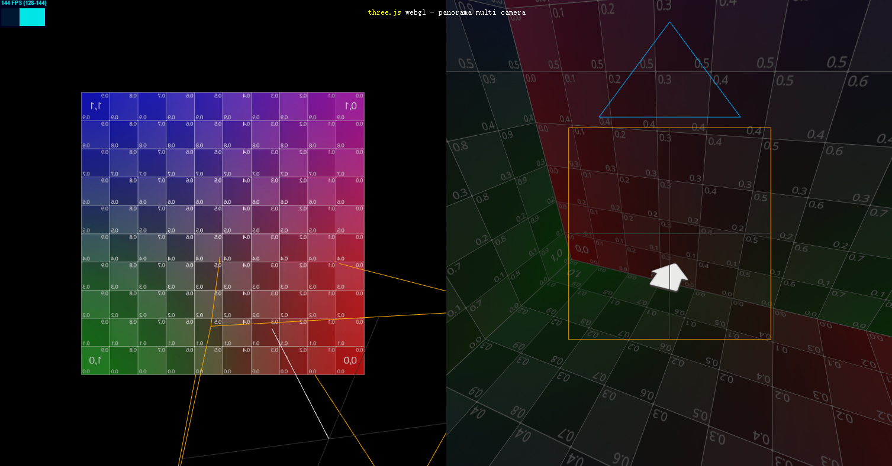
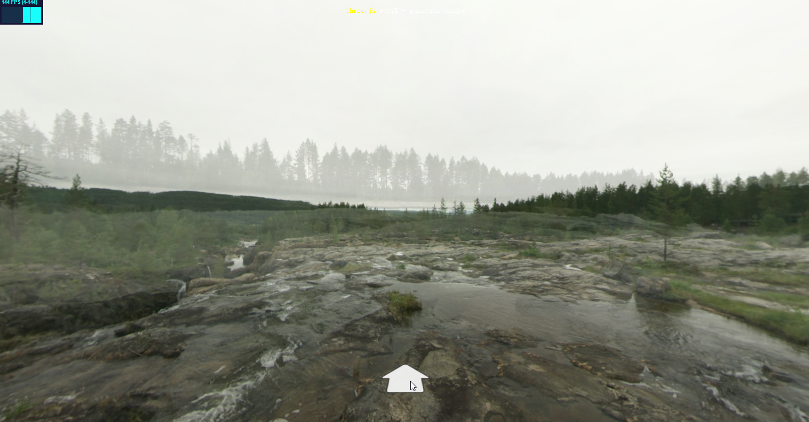

# threejs-demo

## 全景图切换

### [PanoramaBox](panorama/PanoramaBox.html)

模仿百度全景，添加箭头指示标。点击箭头时，实现简单的背景切换。

### [PanoramaMultiCamera](panorama/PanoramaMultiCamera.html)

在 `PanoramaBox` 的基础上分屏，以上帝视角观察全景盒子

### [PanoramaShader](panorama/PanoramaShader.html)

利用着色器实现全景图`淡入淡出`切换

